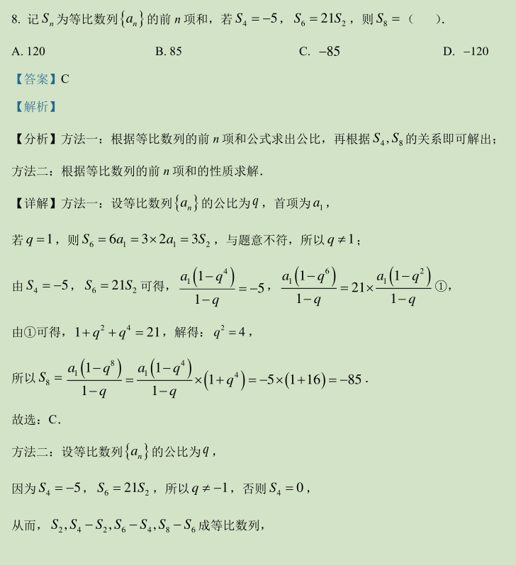
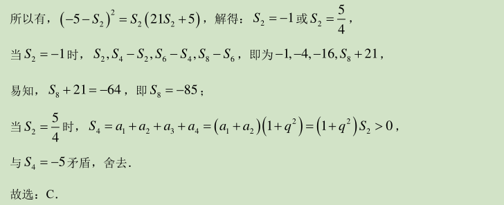
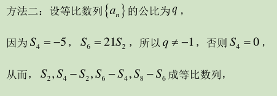

## **本文采用markdown和LaTeX语言编辑，通过git技术同步至网页。用于疑难问题的记录。**

___

### NO.001(等差数列前*n*项和问题)[未解决]

<!--  ${\color{Green}   \frac{ a_1(1-q^{4}) } {1-q} =21 \times \frac{ a_1(1-q^{2}) } {1-q} }$ -->
<!-- GitHub支持LaTeX颜色显示，但是gitee不支持  -->

以上是原题和解析

关于方法一我思维转不过弯的地方在于：我不清楚如何通过式①得到：

$$ 1+q^{2}+q^{4}=21 $$

我只能通过:

$$\frac{ a_1(1-q^{4}) } {1-q} =21 \times \frac{ a_1(1-q^{2}) } {1-q}$$

化到：

$$ \frac{1-q^{6}}{1-q^{2}}=21  $$
再通过等式左侧上下同乘以 $1+q^{2}$得到：
$$  1-q^{2}-q^{6}+q^{8}=21  $$

除此之外该方法的其他步骤没有任何理解问题。

关于方法二我的疑问则是：

对于开头两句

我不能很好的理解，我尝试用试值法的思想，用一个

  $a_1 = 5 ,q =2$

的等比数列实例（此实例 $\mathit{S_2} =15 ,\mathit{S_4-S_2} = 60$ ）带入其中。

显然该实例不满足方法二第二句的规律。所以它不是一个普适性规律。

那么问题来了，就本题和本方法而言，是怎么由第一句得出第二句的？

我被卡在这里导致无法进行下面其他内容的理解。

### NO.002()[]
